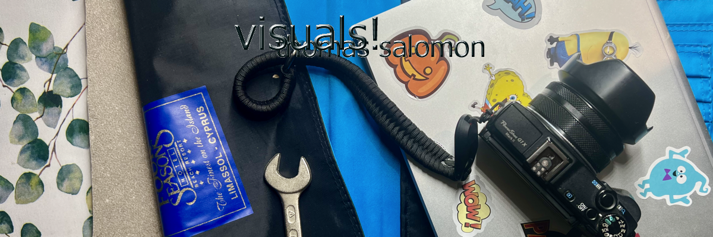

<h1 align="center">Ubuntu SmartStart Kids 🧒🐧</h1>

<p align="center">
  
  <div align="center"><strong>Mein erster Notebook / My first notebook.</strong></div>

<div>
  <a href="#installation">⚙️ Installation</a> • 
  <a href="#software-auswahl">📦 Software-Auswahl</a>
  <a href="#sicherheit--verantwortung">🔐 Sicherheit</a>
  <div>
</p>

Test: VM (UTM) unter MacOs.
Live: Ubuntu 24 LTS

## Konzept

Kompatible und preiswerte Alternative für Kinder ab 10 Jahre)

<details>

- Neben Medienverständnis soll **Technik, Kunst, Medien, Musik, Programmierung** gefördert oder ermöglicht werden
- malen, gestalten, experimentieren, programmieren und lernen stehen im Fokus. 
- kompatible Schulumgebung mit **Microsoft Teams / O365**

## Installation und Desktop experience

- `install.sh` – Einstiegspunkt für die Installation, holt zu installiernde Komponenten aus software-list.txt
- Weitere `install-*.sh`- Dateien für Teilinstallationen
- toggle-app.sh isnstalliert, wenn die Software fehlt, löscht ansonsten.
- `uninstall.sh` – Entfernt installierte Komponenten basierenden auf software-list.txt/ optional
- `install-browser.sh` – Installiert Firefox & Edge 
- `configure-desktop.sh` – Passt GNOME-Einstellungen an, muss im Userkontext aufgeführt werden


## Desktop - Erfahrung

### Night Light aktivieren:
1.	Einstellungen öffnen- > Bildschirm oder Anzeige auswählen
2.	Night Light einschalten
3.	Optional: Zeitplan einstellen
		•	Sonnenuntergang bis Sonnenaufgang
		•	oder eigene Zeiten
.	Farbtemperatur nach Geschmack einstellen

</details>


## (System & Entwicklung)
🧩 1. Junior Programming (Concept)

“Junior programming” is a category of educational software aimed at helping children (roughly ages 6–12) learn programming logic through visual, playful interfaces.

It emphasizes:
	•	Building with blocks rather than typing code.
	•	Immediate visual feedback (animations, sounds, or actions).
	•	Concepts like loops, conditions, variables, and events, introduced through games or projects.

| Tool            | Zweck                          |
|----------------|---------------------------------|
| `curl`, `git`  | Grundlegende Werkzeuge          |
| `openssh`      | Fernwartung, später auch hilfreich |
| `python3`, `pip`, `npm` | Einstieg ins Programmieren |
| `vscode`       | erweiterbarer Code-Editor: kann fast alles ausser Kaffe kochen. |
| `node`, `docker`, `powershell` | Für spätere Tech-Experimente |

</details>

## Berücksichtigte (Lern) Software

<details>

### Lernen & Bildung
| Tool              | Zweck                           |
|------------------|----------------------------------|
| `gcompris`        | Lernspiele: Mathe, Logik, Sprachen |
| `scratch`         | Visuelles Programmieren mit Bausteinen |
| `kalgebra`, `kgeography`, `kstars` | KDE Edu Suite: Mathe, Geografie, Astronomie |
| `libreoffice`     | Text, Tabellen, Präsentationen  |
| `keepassxc`       | Passwortverwaltung – sicher von Anfang an |

### Kreativität (Bild & Video)

| Tool         | Zweck                                |
|--------------|---------------------------------------|
| `krita`      | Digitale Malerei & Zeichnen           |
| `gimp`       | Bildbearbeitung                       |
| `inkscape`   | Vektor-Grafiken                       |
| `blender`    | 3D-Modellierung & Animation           |
| `rawTherapee`  | Fotobearbeitung (RAW-Entwicklung)     |
| `shotwell`   | Bildverwaltung                        |
| `kdenlive`   | Videos schneiden                      |
| `imagemagick`| Kommandozeilen-Bildbearbeitung        |


### Audio, Musik & Medien

| Tool        | Zweck                                |
|-------------|---------------------------------------|
| `audacity`  | Audioaufnahme & Bearbeitung           |
| `guitarix`  |virtueller Gitarrenverstärker          |
| `tuxguitar`  | Gitarren-notation          |
| `vlc`       | Universeller Medienplayer             |
| (Optional: `sonic-pi`) | Für Musik-Experimente – kann später nachinstalliert werden |

### Kommunikation / Schule

| Tool        | Zweck                                 |
|-------------|----------------------------------------|
| `edge`    | Webbrowser für maximale Office/Teams-Kompatibilität |
| `firefox`    | Webbrowser für privacy|
| `teams`    | nur via MS-Edge-Browser|

<d/etails>

## 🛠️ Nutzung des Installationsscripts (⚠️ wfm)

```bash
git clone https://github.com/codegarden13/ubuntu-smartstart-kids.git
cd ubuntu-setup
chmod +x install.sh
./install.sh
```

... oder als ZIP herunterladen und klassisch (1990) herumstöbern. 🎸


## 🔐 Sicherheit & Verantwortung

<details>

- Installiert per `apt`, **nur offizielle Paketquellen oder `.deb`-Installationen** , in Ausnahmefällen Flatpak.

- Deinstalliert zuerst Snap von Ubuntu, um das als einziges damit vorinstallierte Programm Firefox durch den offiziellen Firefox zu ersetzen (APT)
- Alles aus offiziellen Quellen bzw. als .deb geprüft eingebunden
- Keine automatisierte Konfiguration von Cloud-Logins oder persönlichen Konten
- Eltern/Betreuende sollten Installationen einmal manuell überprüfen.

> ⚠️ Mail-Clients wie `geary` oder `thunderbird` sind **deaktiviert**, da viele Schulen Microsoft 365/Teams verwenden. 
> Das ist auch der Grund für Edge, der auch auf den Schulrechnern läuft. Die Lesezeichen lassen sich syncronisieren.

